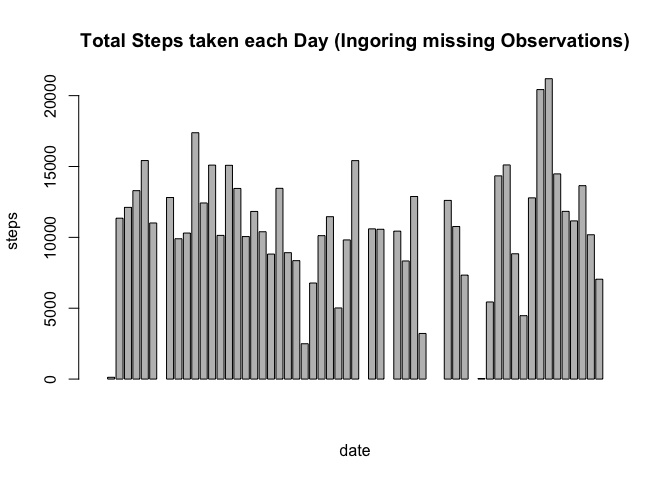
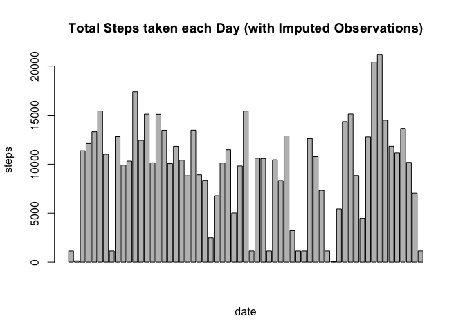
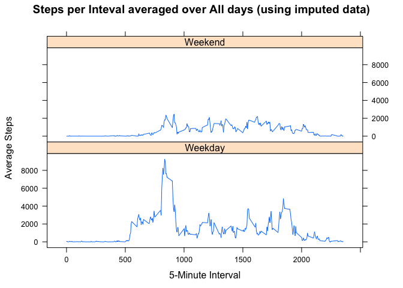

# Reproducible Research: Peer Assessment 1

## Loading and preprocessing the data

1. Load the data (i.e. `read.csv()`)

* download the data if it is necessary (missing)
* create a data directory
* unpack (unzip the data -- into the data directory)
* load the data

2. Process/transform the data (if necessary) into a format suitable for your analysis

This is done on loading the data with the appropriate switches:
* nsure the data is ready for usage by:
* na.strings="NA" -- text marked as NA is read as missing data
* colClasses=c(NA,"Date",NA) -- the second column is recognized as date values and other are the default values

The code that accomplishes this is:


```r
# file already included in assignment -- next line show how to get the data if needed
# download.file("https://d396qusza40orc.cloudfront.net/repdata%2Fdata%2Factivity.zip", "activity-data.zip", methodi="curl")
# create a data directory & unzip the data
data_path = "data"
dir.create( data_path )
```

```
## Warning in dir.create(data_path): 'data' already exists
```

```r
unzip("activity.zip", exdir="data", overwrite=TRUE)
data_file = list.files(path = data_path)[1]
path_file = file.path(data_path, data_file)
# READ the data into R
#      missing data is marked as NA (ensure the data is suitable for processing)
#      the second column is a date format (ensure data is suitable for processing)
#activity_df = read.table(path_file, header=TRUE, sep=",", na.strings="NA", row.names=NULL)
#activity_df[[2]] <- as.Date(activity_df[[2]])
activity_df = read.table(path_file, header=TRUE, sep=",", na.strings="NA", colClasses=c(NA,"Date",NA),row.names=NULL)
```


## What is mean total number of steps taken per day?

1. Make a histogram of the total number of steps taken each day


```r
# AVERAGE STEPS / DAY
library(data.table)
activity_dt = data.table(activity_df)
steps_each_day = activity_dt[,sum(steps),by=date]
setnames(steps_each_day, "V1", "daily_step_total")
barplot(steps_each_day$daily_step_total, xlab="date", ylab="steps", main="Total Steps taken each Day (Ingoring missing Observations)")
```

 


2. Calculate and report the **mean** and **median** total number of steps taken per day

The mean steps taken per day are: 

```r
mean_steps_per_day = mean( steps_each_day$daily_step_total, na.rm=TRUE )
median_steps_per_day = median( steps_each_day$daily_step_total, na.rm=TRUE )
```

Calculation | Results without imputation
------------|---------------------------
*Mean*      | 10766.1887   
*Median*    | 10765 


## What is the average daily activity pattern?

1. Make a time series plot (i.e. `type = "l"`) of the 5-minute interval (x-axis) and the average number of steps taken, averaged across all days (y-axis)


```r
# calculate interval averages over each day
interval_steps_mean_dt = activity_dt[,mean(steps, na.rm=TRUE), by=interval]
setnames(interval_steps_mean_dt, "V1", "average_inverval_steps")
# graph interval averages as time series plot
plot( interval_steps_mean_dt, type="l", xlab="5-minute intervals", ylab="average steps", main="Mean Steps per Interval over all Days  (ignoring MISSING Observations)" )
```

 


2. Which 5-minute interval, on average across all the days in the dataset, contains the maximum number of steps?


```r
max_interval_steps = interval_steps_mean_dt[,max(average_inverval_steps, na.rm=TRUE)]
max_steps_location = which( interval_steps_mean_dt$average_inverval_steps == max_interval_steps)
max_steps_interval = interval_steps_mean_dt$interval[[max_steps_location]]
```

The interval with the maximum steps is: **835**

## Imputing missing values

1. Calculate and report the total number of missing values in the dataset (i.e. the total number of rows with `NA`s)


```r
missing_observations = sum(is.na(activity_dt$steps))
total_observations = nrow(activity_dt)
missing_percent = missing_observations / total_observations * 100
```

Description | Count
------------|------
Missing Observations | 2304
Total Observations   | 17568

Percentage of missing observations: **13.1%**


2. Devise a strategy for filling in all of the missing values in the dataset. The strategy does not need to be sophisticated.

The strategy used is to will fill-in missing values with the median intervals value over all the days of the study.  This is probably a reasonable way to impute missing values, since many people have a daily rythm of sleep and activity.  A complicating factor is of course weekends when many people change their activities, but since a simple strategy can be used, this compounding factor will be ignored for now.

3. Create a new dataset that is equal to the original dataset but with the missing data filled in.


```r
# calculate each interval's median steps
interval_steps_median_dt = activity_dt[,median(steps, na.rm=TRUE), by=interval]
setnames(interval_steps_median_dt, "V1", "median_inverval_steps")

# build a copy for imputed values
activity_dt <- merge(activity_dt, interval_steps_median_dt, by="interval", all=FALSE)

# mark observations with missing data
activity_dt$na_data <- is.na(activity_dt$steps)

# copy the steps to create an imputed steps field
activity_dt$imputed_steps <- activity_dt$steps

activity_dt[na_data==TRUE, imputed_steps := median_inverval_steps]
```

```
##        interval steps       date median_inverval_steps na_data
##     1:        0    NA 2012-10-01                     0    TRUE
##     2:        0     0 2012-10-02                     0   FALSE
##     3:        0     0 2012-10-03                     0   FALSE
##     4:        0    47 2012-10-04                     0   FALSE
##     5:        0     0 2012-10-05                     0   FALSE
##    ---                                                        
## 17564:     2355     0 2012-11-26                     0   FALSE
## 17565:     2355     0 2012-11-27                     0   FALSE
## 17566:     2355     0 2012-11-28                     0   FALSE
## 17567:     2355     0 2012-11-29                     0   FALSE
## 17568:     2355    NA 2012-11-30                     0    TRUE
##        imputed_steps
##     1:             0
##     2:             0
##     3:             0
##     4:            47
##     5:             0
##    ---              
## 17564:             0
## 17565:             0
## 17566:             0
## 17567:             0
## 17568:             0
```

```r
# create a clean imputed value data frame
#impute_activity_dt[,c("na_data", "median_inverval_steps") := NULL]
```


4. Make a histogram of the total number of steps taken each day and Calculate and report the **mean** and **median** total number of steps taken per day. Do these values differ from the estimates from the first part of the assignment? What is the impact of imputing missing data on the estimates of the total daily number of steps?

* HISTOGRAM of imputed data


```r
imputed_steps_each_day = activity_dt[,sum(imputed_steps),by=date]
setnames(imputed_steps_each_day, "V1", "daily_step_total")
barplot(imputed_steps_each_day$daily_step_total, xlab="date", ylab="steps", main="Total Steps taken each Day (with Imputed Observations)")
```

 


* CALCULATE -- mean and median


```r
imputed_steps_each_day = activity_dt[,sum(imputed_steps),by=date]
setnames(imputed_steps_each_day, "V1", "daily_step_total")
imputed_mean_steps_per_day = mean( imputed_steps_each_day$daily_step_total )
imputed_median_steps_per_day = median( imputed_steps_each_day$daily_step_total )
```

Data Used | Mean | Median 
----------|------|-------
Impute Missing Steps | 9503.9 | 10395
Omit Missing Steps   | 10766.2 | 10765

* Do the result differ? If so what is the impact on steps per day?

Ingoring missing values and imputing missing values produces different results.
Ingoring missing values results in calculations that indicate MORE steps per day than with imputed values (indicating possibly inflated results).


## Are there differences in activity patterns between weekdays and weekends?

1. Create a new factor variable in the dataset with two levels -- "weekday" and "weekend" indicating whether a given date is a weekday or weekend day.


```r
activity_dt$day_of_week <- as.POSIXlt(activity_dt$date)$wday
activity_dt$day_name <- as.factor( c("Sunday", "Monday", "Tuesday", "Wednesday", "Thursday", "Friday", "Saturday")[as.POSIXlt(activity_dt$date)$wday + 1] )
activity_dt$day_type <- as.factor( c("Weekend", "Weekday", "Weekday", "Weekday", "Weekday", "Weekday", "Weekend")[as.POSIXlt(activity_dt$date)$wday + 1] )
str(activity_dt)
```

```
## Classes 'data.table' and 'data.frame':	17568 obs. of  9 variables:
##  $ interval             : int  0 0 0 0 0 0 0 0 0 0 ...
##  $ steps                : int  NA 0 0 47 0 0 0 NA 0 34 ...
##  $ date                 : Date, format: "2012-10-01" "2012-10-02" ...
##  $ median_inverval_steps: int  0 0 0 0 0 0 0 0 0 0 ...
##  $ na_data              : logi  TRUE FALSE FALSE FALSE FALSE FALSE ...
##  $ imputed_steps        : int  0 0 0 47 0 0 0 0 0 34 ...
##  $ day_of_week          : int  1 2 3 4 5 6 0 1 2 3 ...
##  $ day_name             : Factor w/ 7 levels "Friday","Monday",..: 2 6 7 5 1 3 4 2 6 7 ...
##  $ day_type             : Factor w/ 2 levels "Weekday","Weekend": 1 1 1 1 1 2 2 1 1 1 ...
##  - attr(*, "sorted")= chr "interval"
##  - attr(*, ".internal.selfref")=<externalptr> 
##  - attr(*, "index")= atomic  
##   ..- attr(*, "na_data")= int  2 3 4 5 6 7 9 10 11 12 ...
```


2. Make a panel plot containing a time series plot (i.e. `type = "l"`) of the 5-minute interval (x-axis) and the average number of steps taken, averaged across all weekday days or weekend days (y-axis). The plot should look something like the following, which was created using **simulated data**:


```r
library(lattice)
day_type_steps_each_interval = activity_dt[ ,sum(imputed_steps), by=list(interval, day_type) ]
setnames(day_type_steps_each_interval, "V1", "mean_imputed_interval_steps")
xyplot( mean_imputed_interval_steps ~ interval | day_type, 
        type = "l",
        data = day_type_steps_each_interval,
        main="Steps per Inteval averaged over All days (using imputed data)", 
        ylab="Average Steps", 
        xlab="5-Minute Interval",
        layout=c(1,2) )
```

 
